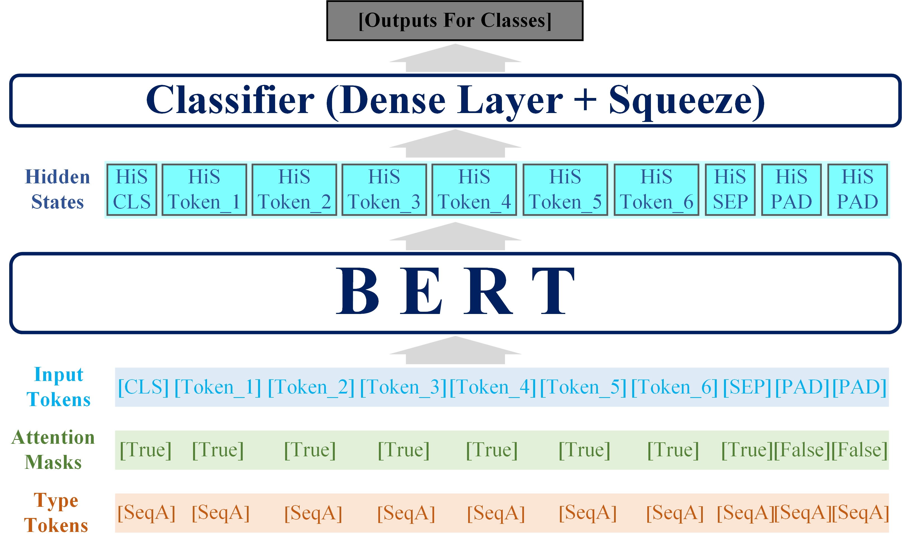

> **Overview**
> -
> ---
> 
 This engineering project revolves around a task in the field of NLP - sentence classification.
> At the heart of the project lies the adoption of the pre-trained language model BERT (Bidirectional Encoder Representations 
> from Transformers) provided by HuggingFace as the foundational framework. The model underwent supervised fine-tuning, 
> involving a series of adjustments and optimizations. Through these efforts, the model has successfully captured logical 
> relationships and entailment information between texts, demonstrating accuracy in classification of Chinese news headlines. Currently, 
> all datasets, model, and files and codes related to training and testing used in this project have been open-sourced for public access and use.
> 

> **BERT**  
> -
> _Reference_: https://paperswithcode.com/paper/bert-pre-training-of-deep-bidirectional.
> 
> ---
> 
> 
>
BERT (Bidirectional Encoder Representations from Transformers), 
> which was introduced by Google in 2018, 
> is fundamentally rooted in the concept of bidirectional self-attention. 
> It operates as an Encoder-only Transformer model, 
> focusing solely on the encoding phase without a corresponding decoder component. 
> This architectural choice allows BERT to deeply understand and process textual data by considering both the left 
> and right contexts simultaneously, thereby capturing a more comprehensive and nuanced understanding of language. 
> By leveraging this powerful mechanism, BERT has proven to be highly effective in a wide range of NLP tasks, 
> including but not limited to sentence classification, where it has demonstrated remarkable accuracy and performance.

>  
>
Bidirectional self-attention is an essential component in BERT. 
> It allows BERT to consider other words in the sentence when processing each word, 
> thereby achieving a deep understanding of the context. 
> This mechanism is based on the Self-Attention Mechanism of the Transformer architecture,
> but unlike traditional self-attention mechanism, it adopts a bidirectional training approach. 
> This means that when predicting a word during pre-training, 
> BERT can simultaneously utilize the contextual information from both the left and right sides of the word, 
> enabling it to gain a deeper understanding of the entire text. 

> **Environment**
> -
> ---
> * **Hardware:** CPU == AMD Ryzen 7 5800H; GPU == NVIDIA GeForce RTX3070 Laptop (8GB);
>  RAM == Micron Technology DDR4 (16GB).
> ---
> * **Software:**  IDE == Pycharm 2023.2;  Python == 3.11;  Pytorch == 2.2.1;
>   transformers == 4.42.3.
> ---
> * **Notice:** 
> There are some compatibility issues between the versions of Pytorch and transformers, 
> so some warnings will be reported by Pycharm during training and test.

> **Training&Test**
> -
> ---
> * **Model:**  
> BertForSequenceClassification( 
  (bert): BertModel( 
    (embeddings): BertEmbeddings( 
      (word_embeddings): Embedding(21128, 768, padding_idx=0) 
      (position_embeddings): Embedding(512, 768) 
      (token_type_embeddings): Embedding(2, 768) 
      (LayerNorm): LayerNorm((768,), eps=1e-12, elementwise_affine=True) 
      (dropout): Dropout(p=0.1, inplace=False)
    ) 
    (encoder): BertEncoder( 
      (layer): ModuleList( 
        (0-11): 12 x BertLayer( 
          (attention): BertAttention( 
            (self): BertSdpaSelfAttention(
              (query): Linear(in_features=768, out_features=768, bias=True) 
              (key): Linear(in_features=768, out_features=768, bias=True) 
              (value): Linear(in_features=768, out_features=768, bias=True) 
              (dropout): Dropout(p=0.1, inplace=False)
            ) 
            (output): BertSelfOutput( 
              (dense): Linear(in_features=768, out_features=768, bias=True) 
              (LayerNorm): LayerNorm((768,), eps=1e-12, elementwise_affine=True) 
              (dropout): Dropout(p=0.1, inplace=False)
            )
          ) 
          (intermediate): BertIntermediate( 
            (dense): Linear(in_features=768, out_features=3072, bias=True) 
            (intermediate_act_fn): GELUActivation()
          ) 
          (output): BertOutput( 
            (dense): Linear(in_features=3072, out_features=768, bias=True) 
            (LayerNorm): LayerNorm((768,), eps=1e-12, elementwise_affine=True) 
            (dropout): Dropout(p=0.1, inplace=False)
          )
        )
      )
    ) 
    (pooler): BertPooler( 
      (dense): Linear(in_features=768, out_features=768, bias=True) 
      (activation): Tanh()
    )
  ) 
  (dropout): Dropout(p=0.1, inplace=False) 
  (classifier): Linear(in_features=768, out_features=10, bias=True)
) 
> ---
> * **TrainingPart:**  
> 
> ---
> * **TestPart:**  
> 
